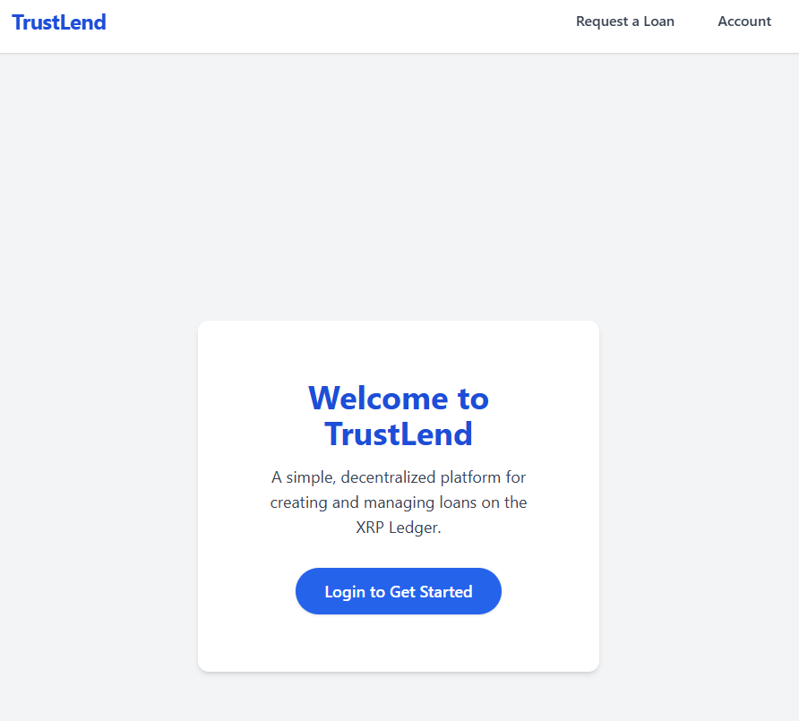
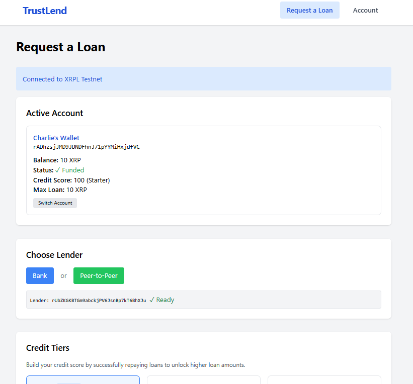
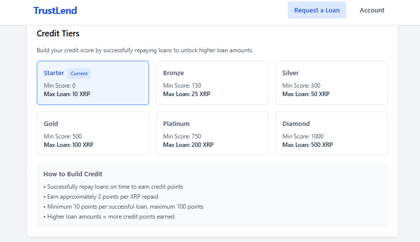
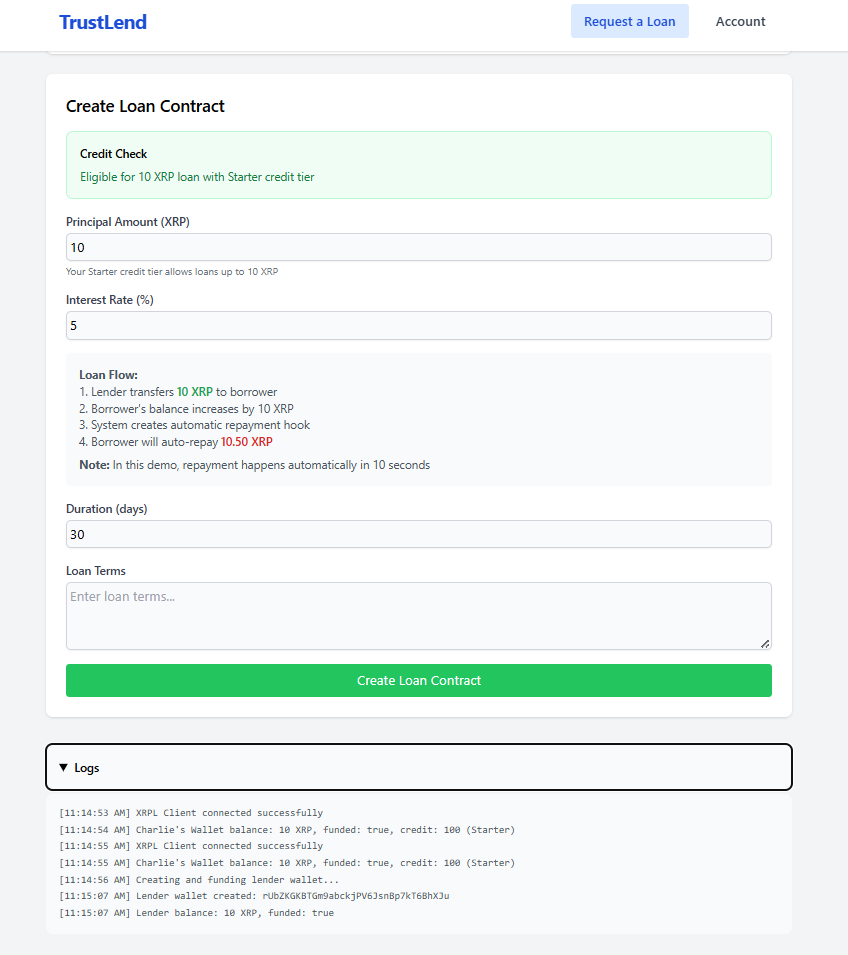
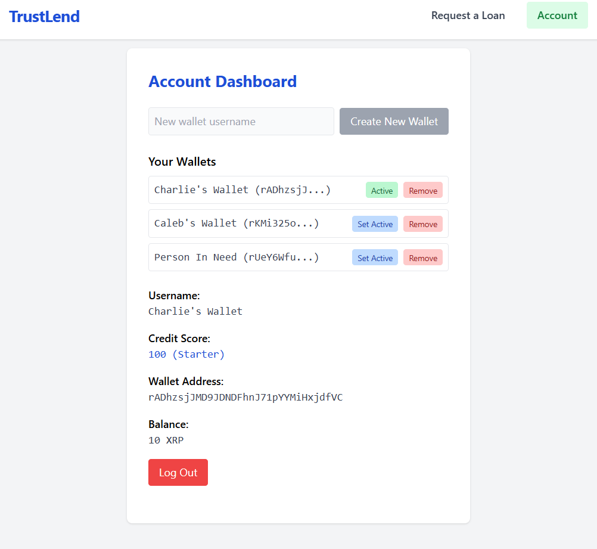

# TrustLend

A simple, decentralized platform for creating and managing loans on the XRP Ledger (XRPL).

---

## 🚀 Overview

**TrustLend** lets users request, receive, and repay loans on the XRP Ledger. The platform features a credit score system, automatic repayments, and a user-friendly interface for both borrowers and lenders.

---
## 🎥 Demo Video

<iframe src="https://www.loom.com/embed/d66592c0bc014c4fb86804a25cf30af9?sid=f894fd78-321c-403b-8e3c-5b7e2a9a24e0" frameborder="0" webkitallowfullscreen mozallowfullscreen allowfullscreen width="100%" height="400"></iframe>

Click [here](https://www.loom.com/embed/d66592c0bc014c4fb86804a25cf30af9?sid=f894fd78-321c-403b-8e3c-5b7e2a9a24e0) if the video above is not displayed

---

## 📸 Screenshots

| Login Page | Request a Loan | Credit Tiers | Crete Loan Contract | Account Dashboard |
|:----------:|:--------------:|:------------:|:-------------------:|:-----------------:|
|  |  |  |  |  |

---

## 🔗 How TrustLend Interacts with the XRP Ledger

- **Wallet Creation:**
  - When you log in or create an account, TrustLend generates a new XRPL testnet wallet in your browser (using xrpl.js) and funds it via the XRPL testnet faucet.
  - Wallets are stored locally in your browser for privacy and security.

- **Loan Transactions:**
  - When you request a loan, the app creates and submits a payment transaction on the XRPL testnet from the lender to the borrower.
  - All transactions are signed client-side and sent directly to the XRPL testnet via WebSocket.
  - Demo loans are automatically repaid after a short period by submitting a repayment transaction.

- **Credit Score Updates:**
  - After each successful repayment, your credit score is updated locally and reflected in your wallet's metadata.
  - Higher credit scores unlock higher loan tiers.

- **Transparency:**
  - All loan and repayment transactions are visible on the XRP Ledger testnet and can be viewed using a block explorer at [XRPL Testnet Explorer](https://testnet.xrpl.org/).

## ✨ Features

- **Decentralized Loans:** Request and receive loans directly on XRPL testnet.
- **Credit Score System:** Build your credit by repaying loans on time and unlock higher loan amounts.
- **Automatic Repayment:** Demo loans auto-repay after a short period for easy testing.
- **Peer-to-Peer or Bank Lender:** Choose to borrow from a demo bank or input a peer lender address.
- **Modern UI:** Clean, simple, and responsive React/Next.js frontend.

---

## 🖥️ Tech Stack

- **Frontend:** React, TypeScript, Tailwind CSS
- **Backend:** Next.js, localStorage
- **Web3:** XRPL.js

---

## ⚡ Quick Start

1. **Clone the repo:**
   ```bash
   git clone https://github.com/your-username/trustlend-xrpl.git
   cd trustlend-xrpl
   ```
2. **Install dependencies:**
   ```bash
   npm install
   ```
3. **Run the app locally:**
   ```bash
   npm run dev
   ```
4. **Open in your browser:**
   Visit [http://localhost:3000](http://localhost:3000)

---

## 📝 Usage

1. **Login or Create Wallet:**
   - On first visit, log in to create a new XRPL testnet wallet (stored locally).
2. **Request a Loan:**
   - Choose a lender (Bank or Peer-to-Peer).
   - Enter the loan amount, interest rate, and duration.
   - Submit the request and receive XRP if eligible.
3. **Repay & Build Credit:**
   - Demo loans auto-repay after 10 seconds.
   - Successful repayments increase your credit score, unlocking higher loan tiers.
